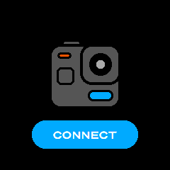
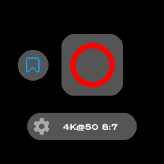
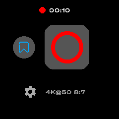
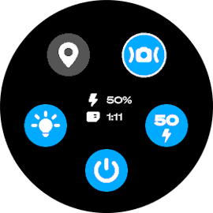
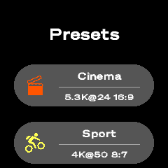
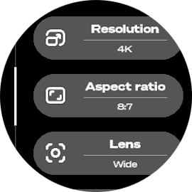

# 
        GoPro Remote for Garmin  

A ConnectIQ widget to control your GoPro from your wrist. It uses the [Open GoPro Bluetooth Low Energy API](https://gopro.github.io/OpenGoPro/ble/index.html) and the [Garmin ConnectIQ SDK](https://developer.garmin.com/connect-iq/overview/).

The widget should support every Garmin watch compatible with encrypted BLE connection (see devices supported by the [requestBond method](https://developer.garmin.com/connect-iq/api-docs/Toybox/BluetoothLowEnergy/Device.html#requestBond-instance_function)) and every GoPro camera compatible with the Open GoPro API (HERO9+). However, it has only been tested with a HERO11 Black Mini. A previous version of this app for smartwatches without BLE capabilities can be found and built with the [legacy branch](https://github.com/ad220/gopro-remote-connectiq/tree/legacy) or in the GitHub releases versions prior to 3.0.

Please note that this app was mainly developed for personal use, it should now be stable enough but you may still encounter a few bugs.

## Features
- allows a Garmin watch to control a GoPro HERO 9/10/11/11 Mini/12/13 and MAX2
- press shutter (start and stop video)
- add hilight when recording
- change video settings manually (resolution, aspect ratio, lens and framerate)
- change video settings with customizable presets
- edit camera settings (hypersmooth, gps, leds, anti-flicker)

### Moved to another app
- QR Code generator for GoPro Labs support

### Planned
- automatic report of error codes
- better support for MAX2 (switch between single lens and 360 mode)
- unofficial api support for older cameras (HERO 5+)
- protune settings and more
- add photo and timelapse support

## Installation
The widget is available on the [Garmin Connect IQ store](https://apps.garmin.com/apps/f9e09224-1c60-4e94-a616-f9ef10932fdf). You can install it directly from your Garmin Connect app on your smartphone.

You can also build the widget for your specific device with the Garmin SDK and the VSCode extension. Then, plug your watch to the computer with the USB cable in mass storage mode, and copy the generated `.prg` file to the `/GARMIN/APPS` folder on your device.

## How to use it
On the first launch, press the pair button on the main screen of the widget and put your GoPro in pairing mode. After being scanned by the watch, select the camera and wait for it to validate pairing. Once it is done, you should see the remote screen with the shutter button and the GoPro current settings.

On this view, press the select button on your watch to start recording and the up button to hilight during capture. Using the up button when the camera is idle will open the camera settings menu and while the down down button will open the video settings menu. In this menu, you can apply a defined preset, manually change video settings or save the current applied video settings as a preset. Be careful as applying a preset with another anti-flicker setting than the current one (i.e. 50/60 fps) won't work properly.

## Screenshot gallery

## Changelog

### v4.1
- Add error codes
- Bug fixes

### v4.0
- Add theoretical support for non BLE capable watches through companion app v2[(*)](#disclaimer)
- Low-end UI for watches with a memory smaller than 60kB
- Non regression tests 
- Bug fixes

### v3.4
- Add support for MAX2 camera
- Optimize memory usage of the app

### v3.3
- Update icons and add antialiasing
- Add battery and sd card status in the camera settings menu
- Add fonts that scale with any screen size
- Update notif look
- Direct app exit when started from glance
- Auto camera shutdown on app exit if it's not recording
- Optimize the user interface performance

### v3.2
- Add glance view

### v3.1
- Add camera settings togglables menu
- Fix various bugs on camera disconnect
- Update app icon

### v3.0
- Allow direct BLE connection to GoPro cameras without companion app.
- Remove support for device with API support lower than 3.2.0
- Add support for HERO13 (not tested)
- Improve stability

### v2.0
- Add support for more cameras (HERO9 to HERO12)

### v1.1
- Add support for Garmin watches without touchscreen and bigger screens with a scalable ui.

### v1.0
- First version of the app, hardcoded for 240x240 garmin watches with touchscreen and HERO11 Black Mini ; needs companion app.

## Disclaimer
(*): Garmin broke companion apps a while ago and it's been impossible to communicate between a watch and a custom Android app since then. On the day it comes back, I'll be able to add support for 60+ watch models to bring the new features to the [legacy app](https://github.com/ad220/gopro-remote-connectiq/tree/legacy).