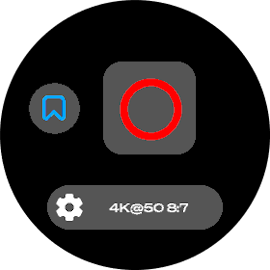

# GoPro remote for Garmin watch
A ConnectIQ widget to control your GoPro from your wrist. It uses the [Open GoPro Bluetooth Low Energy API](https://gopro.github.io/OpenGoPro/ble_2_0) and the [Garmin ConnectIQ SDK](https://developer.garmin.com/connect-iq/overview/).

The widget is now supporting every mainstream Garmin watch with API level 2.4.0 and above. Since v2.0, it also works with every GoPro camera supporting the Open GoPro API (HERO9+) except the newer GoPro HERO 13 Black due to API changes.

This app must be used in pair with the [Android companion app](https://github.com/ad220/gopro-remote-companion-android) as a bridge to communicate with the GoPro.

Please note that this app was mainly developed for personal use, it should now be stable enough but you may still encounter a few bugs.

## Features
- allows a Garmin watch to control a GoPro HERO 9-12
- press shutter (start and stop video)
- add hilight when recording
- change camera settings manually
- change camera settings with customizable presets

### Planned [(*)](#disclaimer)
- add photo support
- add hypersmooth + most of toggables states
- better info and error pop-ups message
- add direct BLE connection to the GoPro

## Installation
The widget is available on the [Garmin Connect IQ store](https://apps.garmin.com/apps/f9e09224-1c60-4e94-a616-f9ef10932fdf). You can install it directly from your Garmin Connect app on your smartphone.

You can also build the widget for your specific device with the Garmin SDK and the VSCode extension. Then, plug your watch to the computer with the USB cable in mass storage mode, and copy the generated `.prg` file to the `/GARMIN/APPS` folder on your device.

Alternatively you can use the release provided on GitHub. Make sure you are using a version matching the one of the companion app though.

## How to use it
Once the companion app is [installed](https://github.com/ad220/gopro-remote-companion-android#Installation), started and configured on your Android smartphone, the widget is ready to connect to the GoPro.

Press the connect button on the main screen of the widget and wait for the phone to achieve connection with your camera. Once it's done, you should see the remote screen with the shutter button and the GoPro current settings.

Selecting the settings button will allow you to apply a defined preset, manually change camera settings or save the current applied settings as a preset.

## Screenshots gallery

## Disclaimer
(*): The planned features are not guaranteed to be implemented. The development of this app is done on my free time, and with the compatibility additions done in v2, I don't feel like continuing this anymore (at least for now). If you want to help, feel free to contribute to the project.