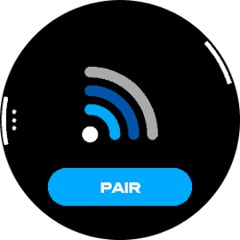

# GoPro remote for Garmin watch
A ConnectIQ widget to control your GoPro from your wrist. Uses the [Open GoPro Bluetooth Low Energy API](https://gopro.github.io/OpenGoPro/ble_2_0) and the [Garmin ConnectIQ SDK](https://developer.garmin.com/connect-iq/overview/).

The widget is now supporting every mainstream Garmin watch with API level 2.4.0 and above. However it is designed to be used specifically with a GoPro HERO11 as the capabilities are hardcoded in the app.

Must be used in pair with the [Android companion app](https://github.com/ad220/gopro-remote-companion-android) as a bridge to communicate with the GoPro.

Please note that the app is still under development and while this should be stable enough to play with, it may still encounter a few bugs.

## Features
- allows a Garmin watch to control a GoPro[*](#disclaimer)
- press shutter (start and stop video)
- add hilight when recording
- change camera settings manually
- change camera settings with customizable presets

### Planned
- achieve full support for all Open GoPro cameras (see [*](#disclaimer))
- add photo support
- add hypersmooth + most of toggables states
- better info and error pop-ups message

## Installation
The widget is available on the [Garmin Connect IQ store](https://apps.garmin.com/apps/f9e09224-1c60-4e94-a616-f9ef10932fdf). You can install it directly from your Garmin Connect app on your smartphone.

You can also build the widget for your specific device with the Garmin SDK and the VSCode extension. Then, plug your watch to the computer with the USB cable in mass storage mode, and copy the generated `.prg` file to the `/GARMIN/APPS` folder on your device.

Alternatively you can use the release provided on GitHub.

## How to use it
Once the companion app is [installed](https://github.com/ad220/gopro-remote-companion-android#Installation), started and configured on your Android smartphone, the widget is ready to connect to the GoPro.

Press the connect button on the main screen of the widget and wait for the phone to achieve connection with your camera. Once it's done, you should see the remote screen with the shutter button and the GoPro current settings.

Selecting the settings button will allow you to apply a defined preset, edit one of these or manually change camera's settings.

## Screenshots gallery

## Disclaimer
(*): The GoPro settings capabilities are hardcoded in the widget according to the GoPro HERO11 Black Mini's [user manual](https://gopro.com/help/productmanuals). Therefore, it may not be able to use the full capabilities of all the other GoPros 